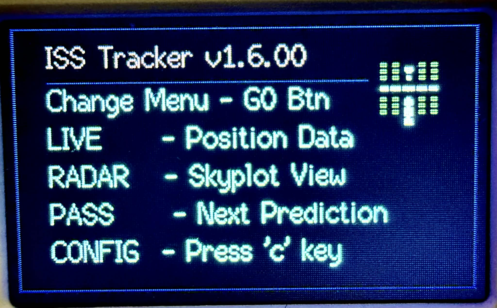
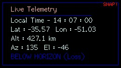
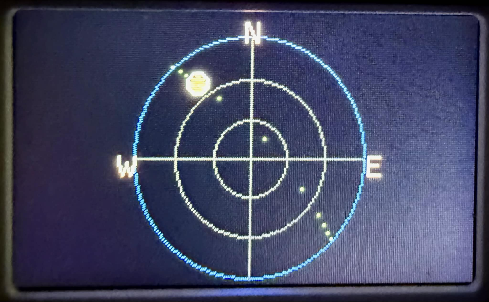
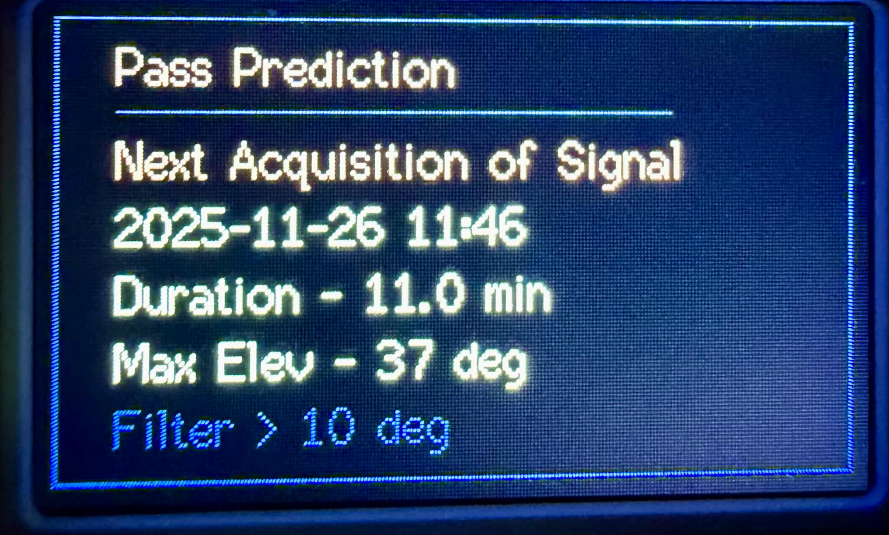
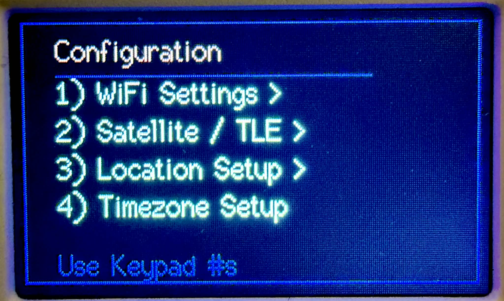
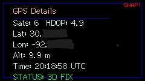
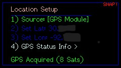
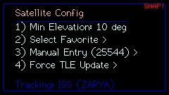
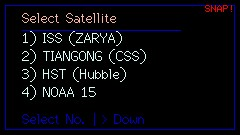

  

# Cardputer Adv ISS/Satellite Tracker

I was looking for a unique project for my Cardputer Adv, and as a ham radio operator, I wanted a dedicated tool to track the ISS (and now **any** satellite) without needing my phone. So, I wrote this Tracker.

It calculates live positions and future passes for the ISS or any other object in the NORAD catalog in real-time.

## Features

- **Universal Tracking:** You are no longer limited to the ISS! Enter any NORAD Catalog Number in the settings to track satellites like Hubble, Tiangong, or NOAA weather satellites.
- **WiFi Network Scanner:** No need to manually type your SSID. The new menu scans for networks and lets you select one from a list.
- **GPS Support:** Supports the Cardputer LoRa/GPS extension to automatically update your Latitude, Longitude, and Time.
- **Live Telemetry:** Shows Azimuth/Elevation, Lat/Lon, and Altitude in real-time.
- **Radar Skyplot:** A visual polar plot showing the satellite's path across the sky relative to your position.
- **Pass Prediction:** Calculates the next visible pass (AOS/LOS) up to 24 hours in advance.
- **Offline Capable:** Once it grabs the TLE data via Wi-Fi, it works completely offline.
- **Smart Navigation:** Use the **Arrow Keys** (`<` and `>`) or the **G0** button to cycle through dashboard screens.

## 🛰️ Popular Satellites to Track

Since v2.0, you can manually enter a Satellite Catalog Number (NORAD ID) in the settings. Here are a few interesting ones to try:

| Name | ID | Description |
| :--- | :--- | :--- |
| **ISS (ZARYA)** | `25544` | International Space Station (Default) |
| **TIANGONG** | `48274` | Chinese Space Station (CSS) |
| **HST** | `20580` | Hubble Space Telescope |
| **BLUEWALKER 3** | `53807` | Massive communications array (very bright) |
| **NOAA 19** | `33591` | Weather satellite (APT images) |
| **NOAA 18** | `28654` | Weather satellite (APT images) |

More can be found at https://www.n2yo.com/

## Setup

1. **WiFi:** Go to `Config > WiFi Settings`. You can now **Scan Networks** and select yours from the list, or enter it manually.
2. **Location:** - **Manual:** Enter your Lat/Lon in the settings.
   - **GPS:** If you have the GPS unit, enable it in `Location Setup`.
3. **Timezone:** Set your UTC offset (e.g., -6 for CST).

*Settings are saved to memory so you only have to do this once.*

## Screenshots

| Home Screen | Live Telemetry |
| :---: | :---: |
|  |  |

| Polar/Radar View | Next Pass Prediction |
| :---: | :---: |
|  |  |

| Options Menu | Location Menu (No GPS) |
| :---: | :---: |
|  |     |

| GPS Status | Location Menu (GPS) |
| :---: | :---: |
|  |   |

| Satellite Config | Select Satellite |
| :---: | :---: |
|  |   |

## Using the polar plot view
- Imagine you are looking down at a compass.
- Going around the outer circle is your azimuth, 0-360 degrees.
- The distance from the outer circle to the center dot is the elevation of the pass, from 0 degrees (outer circle) which is at the horizon, up to 90 degrees (center dot) which is directly above you.

**Example 1:**
1.  Lets say there was a satellite pass that went from E to W and had a max elevation of 90 degrees (straight up above your head).
2.  The dot would start at the E and the line would end at the W.
3.  The dot would track right down the middle from E to W.
4.  When it's at its peak of the pass, the dot would be dead center, since it passes directly over your head at 90 degrees.
5.  When it hits the W, it goes down below the horizon.

**Example 2:** 1.  The satellite comes up from the horizon between East and North, which is where you will see the dot. This is called acquisition of signal (AOS).
2.  At about halfway through the pass, if the peak of the arc is closer to the horizon line (outer circle) it will be a shallow elevation pass (about 15 to 25 degrees above the horizon) and will be more in front of you instead of passing overhead.
3.  At the end of the pass, the dot will be on the other side of the plot and when it reaches the outer circle, it disappears behind the horizon. This is called loss of signal (LOS).

You will find these plots in other applications like Gpredict or satellite tracking websites.

## Hardware

- M5Stack Cardputer ADV  
- USB-C cable
- (Optional) M5Stack LoRa868/GPS Module for automatic location

## Firmware

You can either:

1. **Flash the prebuilt firmware** (easiest), or  
2. **Build from source with PlatformIO** (for hacking / tweaking).

---

## 1. Flash the prebuilt firmware

If you just want to run it:

1. Download the latest bin from the **Releases** page.
2. Flash it using **esptool.py**, **M5Burner**, **your favorite flasher**, or even **load it through M5 Launcher**.
3. Reboot the Cardputer.

--- 
Logo created at [PixilArt.com](https://www.pixilart.com/)
