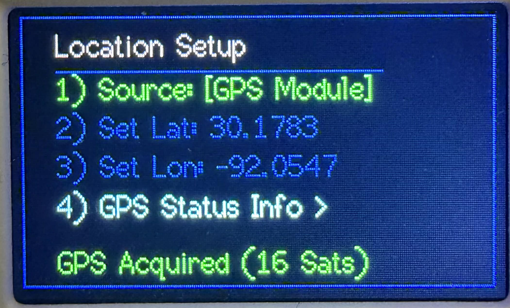

  

# Cardputer Adv ISS Tracker

I was looking for a unique project for my Cardputer Adv, and as a ham radio operator I wanted a dedicated tool to track the ISS (and soon maybe even satellites) without needing my phone. So, I wrote this ISS Tracker.

It calculates the live ISS position and future passes in real-time.

Features:

- Live Telemetry: Shows Azimuth/Elevation and Lat/Lon in real-time.

- Radar Skyplot: A visual polar plot showing the satellite's path across the sky relative to your position.

- Pass Prediction: Calculates the next visible pass (AOS/LOS) up to 24 hours in advance.

- Elevation Filter: You can set a minimum elevation (e.g., 10 deg) so it ignores low passes.

- Offline Capable: Once it grabs the TLE data via Wi-Fi, it works completely offline.

Setup: You just need to enter your Wi-Fi, Lat/Long, and Timezone in the Options menu. It saves everything to memory so you only have to do it once.

## Screenshots

| Home Screen | Live Telemetry |
| :---: | :---: |
|  |  |

| Polar/Radar View | Next Pass Prediction |
| :---: | :---: |
|  |  |

| Options Menu | Location Menu |
| :---: | :---: |
|  |   |

## Using the polar plot view
- Imagine you are looking down at a compass.
- Going around the outer circle is your azmuth, 0-360 degress.
- The distance from the outer circle to the center dot is the elevation of the pass, from 0 degrees (outer circle) which is at the horizon, up to 90 degrees (center dot) which is directly above you.

Example 1:
1.  Lets say there was a satellite pass that went from E to W and had a max elevation of 90 degrees (straight up above your head).
2.  The dot would start at the E and the line would end at the W.
3.  The dot would track right down the middle from E to W.
4.  When it's at it's peak of the pass, the dot would be dead center, since it passes directly over your head at 90 degrees.
5.  When it hits the W, it goes down below the horizon.

Example 2: 
1.  The satellite comes up from the horizon between East and North, which is where you will see the dot. This is called acquisition of signal (AOS).
2.  At about half way through the pass, if the peek of the arc is closer to the horizon line (outer circle) it will be a shallow elevation pass (about 15 to 25 degrees above the horizon) and will be more in front of you instead of passing overhead.
3.  At the end of the pass, the dot will be on the other side of the plot and when it reaches the outer circle, it dissapears behind the horizon.   This is called loss of signal (LOS).

You will find these plots in other applicationsn like Gpredict or satellite tracking websites.

## Hardware

- M5Stack Cardputer ADV  
- USB-C cable

## Firmware

You can either:

1. **Flash the prebuilt firmware** (easiest), or  
2. **Build from source with PlatformIO** (for hacking / tweaking).

---

## 1. Flash the prebuilt firmware

If you just want to run it:

1. Download the latest bin from the **Releases** page.
2. Flash it using **esptool.py**, **M5Burner**, **your favorite flasher**, or even **load it through M5 Launcher**.
3. Reboot the Cardputer.

--- 
Logo created at [PixilArt.com](https://www.pixilart.com/)
